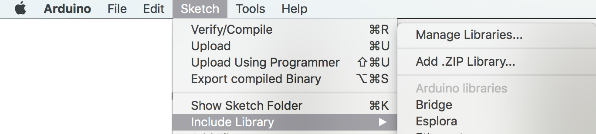
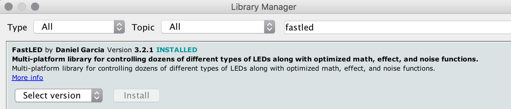
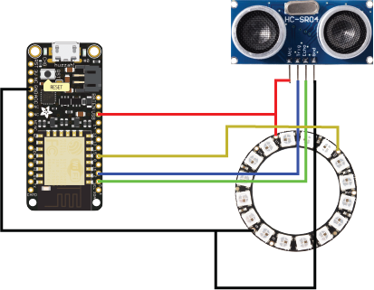

# Interactivity Workshop
## About
This repo exists as a resource to explore interactivity with microcontrollers. This code was originally created for the MediaNet interactive art workshop series in January 2019 but with the full understanding that it may be useful for others in the future.

The basic idea is to show a simple example of mapping and input and output between a sensor, a microcontroller, and a set of individually programmable RGB LEDs.

## Components
This project utilizes three main components:

### Arduino
Specifically, this project was designed to be used with the ESP8266 microcontroller ([Adafruit Huzzah Feather](https://www.bc-robotics.com/shop/adafruit-feather-huzzah-with-esp8266-wifi/)). The Arduino framework is used because it allows for some cross-platform capabilities and will therefore allow this code to be used more broadly with different microcontrollers.

### WS2812 RGB LEDs
These LEDs were chosen for their ubiquity and relative inexpensiveness ([Adafruit NeoPixel Ring](https://www.bc-robotics.com/shop/neopixel-ring-16-rgb-led/)). Individually addressable LEDs allow for a wide range of output behaviour with only a small amount of knowledge. Furthermore, exploring colour space (e.g. RGB vs HSV) and array indexing is highly likely with this type of output (compared to an actuator like a solenoid, which has a small set of output states).

### HCSR04 Ultrasonic Rangefinder
[This device](https://www.bc-robotics.com/shop/ultrasonic-distance-transducer/) was chosen because it is inexpensive and allows for a wide range of control options (e.g. threshold triggering, discrete region mapping, and 'continuous' control). Furthermore, these devices have a large maximum distance range, making them appropriate for use in human interaction.

## Setup
### Download Arduino Software
Go to the Arduino download page [here](https://www.arduino.cc/en/main/software) and select your operating system (Windows, Mac, or Linux).

### Install ESP8266 Board Package
The ESP8266 board package instructions are available [here](https://github.com/esp8266/Arduino#installing-with-boards-manager)

### Install FastLED Library
#### Step 1
In the Arduino menu, select:
```
Sketch -> Include Library -> Manage Libraries
```

#### Step 2
In the search bar, type:
```
fastled
```
Select `verion 3.2.1` and click `install`.


### Download this Code
Click [here](https://github.com/sabjorn/medianet-interactivity-workshop/archive/master.zip) to download this code.

Unzip it and inside you will find a folder called `distanceToLEDs`. This has our `Arduino` code in it.

## Wiring
Below is the circuit diagram for wiring the parts together. Feel free to use a breadboard and to change the pins for each device (just be sure to add adjust those pins in the code!)

